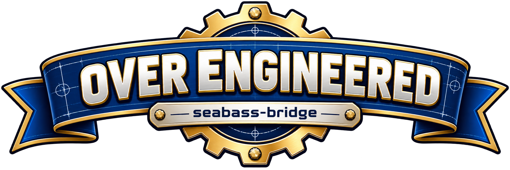

# seabass-bridge

<p align="center">
  
</p>


A lightweight Raspberry Pi 4 appliance build intended to support a **Creality Falcon2 40W laser engraver** workflow.

The project is designed around a disposable Raspberry Pi OS Lite installation:
1. Flash Raspberry Pi OS Lite 64-bit with Raspberry Pi Imager.
2. Configure Wi-Fi and SSH in Imager.
3. Boot the Pi.
4. Clone this repository.
5. Run `sudo ./bootstrap.sh`.

The bootstrap configures the Pi as `seabass-bridge`, installs common diagnostics and camera utilities, enables SSH, creates a predictable directory layout, and installs the project health-check service.

## Project purpose

`seabass-bridge` is being built specifically to support a Creality Falcon2 40W laser engraver by providing a small, rebuildable Raspberry Pi appliance for network-connected USB access, local diagnostics, and webcam monitoring around the engraver workspace.

The primary goal is to let **LightBurn on the main workstation connect to the Creality Falcon2 over the network through a USB-over-IP bridge**. This preserves the normal LightBurn workflow for device communication and positioning while the Raspberry Pi handles the remote USB transport and supporting services.

LightBurn remains on the main workstation; the Raspberry Pi provides the network-side bridge, USB transport, diagnostics, and webcam support.

## Target platform

- Creality Falcon2 40W laser engraver
- Raspberry Pi 4 Model B
- Raspberry Pi OS Lite 64-bit
- Debian 13 (Trixie) current target
- Wi-Fi network connection
- USB webcam supported as an optional monitoring device

Raspberry Pi currently lists Raspberry Pi OS Lite 64-bit for Pi 4 as a supported image.

## Design goals

- Rebuildable from a clean SD card
- GitHub is the source of truth for configuration
- No desktop environment required
- Low resource use
- Easy SSH administration
- Webcam tooling kept separate from USB-device bridging
- Idempotent bootstrap: rerunning it is safe

## Repository layout

```text
seabass-bridge/
├── bootstrap.sh
├── config/
│   └── seabass.env.example
├── docs/
│   ├── INSTALL.md
│   └── ARCHITECTURE.md
├── scripts/
│   └── diagnostics.sh
├── systemd/
│   └── seabass-health.service
└── .github/
    └── workflows/
        └── shellcheck.yml
```

## Quick start

```bash
sudo apt update
sudo apt install -y git
git clone https://github.com/chanley-home/seabass-bridge.git
cd seabass-bridge
sudo ./bootstrap.sh
```

After the bootstrap finishes, reboot:

```bash
sudo reboot
```

Then check:

```bash
hostname
systemctl status ssh --no-pager
systemctl status seabass-health --no-pager
./scripts/diagnostics.sh
```

## USB bridge note

This first build intentionally keeps USB-device bridging as a separate stage rather than silently exporting every attached USB device. That makes it possible to validate the Pi, Wi-Fi, camera, logging, and recovery workflow first and avoids accidentally exposing an unintended USB device.

## Safety

This repository does not automate energizing or starting attached machinery. Keep hardware safety controls local and use the camera as supplementary monitoring, not as a replacement for being present at the equipment.

## License

Original seabass-bridge project code is licensed under the **GNU General Public License v3.0 or later (GPL-3.0-or-later)**.

This program is free software: you can redistribute it and/or modify it under the terms of the GNU General Public License as published by the Free Software Foundation, either version 3 of the License, or (at your option) any later version.

This program is distributed in the hope that it will be useful, but **WITHOUT ANY WARRANTY; without even the implied warranty of MERCHANTABILITY or FITNESS FOR A PARTICULAR PURPOSE.**

See [LICENSE](LICENSE) and [THIRD_PARTY_NOTICES.md](THIRD_PARTY_NOTICES.md).

Third-party software remains under its own license terms and is not relicensed by this project.
